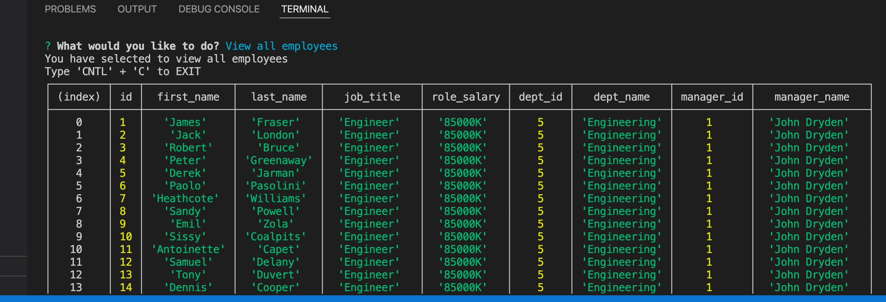
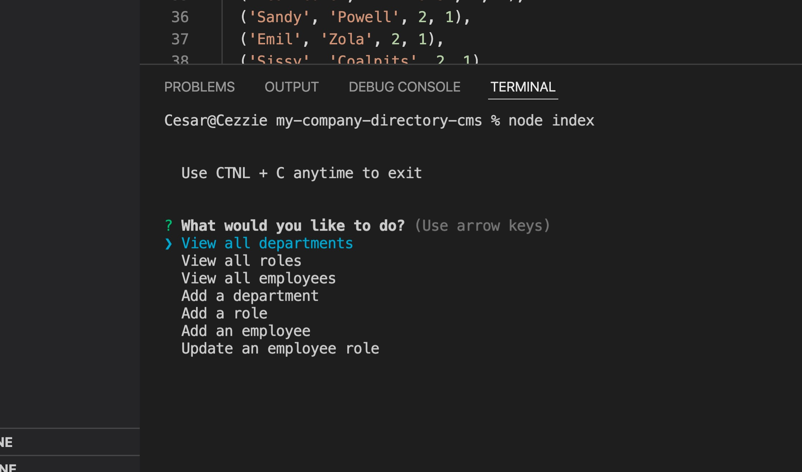
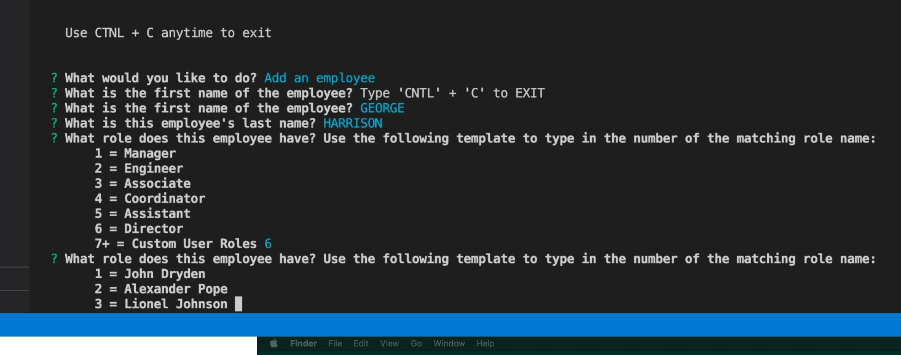

# My Company Directory CMS

This application is a Content Management System for a made up company, in which I am asked to create a database for all the employees of the company using MySQL and Inquirer npm package. 
Employees are organized by name, role, salary, and other notable criteria. This app uses MySQL2 to connect to the database directly from the terminal.

This application can only be run locally. Please clone the repository to your local machine, open the application, download all npm packages, and place your MySQL credentials in the connection.js page.

### Website Link
Github URL: https://github.com/cesarsiguencia/my-company-directory-cms 

### Walkthrough Video
[Link to Tutorial](https://drive.google.com/file/d/1s8tNEh6GtvLDLnfU1pohdDCaXVPPtXAZ/view)

### Screenshots

